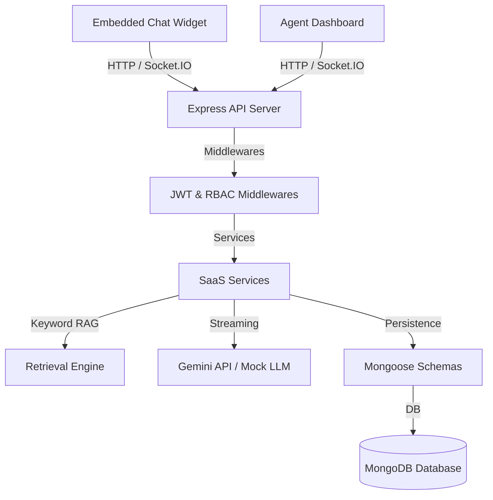

# Chat.io - Multi-Tenant AI Chatbot SaaS Platform

**Chat.io** is a production-ready, multi-tenant AI Chatbot SaaS platform similar to Intercom, Zendesk AI, Tidio, and Crisp. It enables businesses to register accounts, manage workspaces, ingest corporate documents, configure custom AI behaviors, embed floating chat widgets on their websites, and handle live agent takeovers of AI conversations in real time.

---

## 🌟 Core Features

### 🚀 Embedded Widget
- **One-Script Embed**: Embed your AI chatbot anywhere via a single, simple `<script>` tag.
- **Custom Branding**: Adjust widget colors, greetings, assistant names, icons, and logo assets.
- **Session Persistence**: Chat history persists across page refreshes and navigation using secure, local storage session IDs.
- **Dynamic Suggested Prompts**: Configure default starter questions that auto-submit on click.

### 🏢 Multi-Tenant SaaS Backend
- **Workspace Isolation**: Strict tenant scoping (every model configuration, history log, and document chunk is locked to `workspaceId`).
- **Role-Based Access Control (RBAC)**: Enforces access restrictions for `OWNER` (full control), `ADMIN` (workspaces, team, documents), and `AGENT` (chat takeovers).
- **Team Management**: Workspace owners and admins can invite and manage members.
- **Resource Usage Tracking**: Tracks daily and monthly workspace message frequencies, requests, and token counts.

### 📚 Keyword-Based Document RAG Engine
- **Text Extraction**: Parse raw texts from PDF, DOCX, TXT, and Markdown files out-of-the-box.
- **Overlap Chunking**: Clean and divide extracted texts into 1000-character segments with a 100-character overlap.
- **Semantic Retrieval**: A zero-embedding keyword scoring engine that calculates relevance based on keyword density, term occurrences, and exact phrase matching.

### 🔌 Pluggable LLM Integration
- **Google Gemini**: Stream live responses using Gemini SDK and classify handover intents.
- **Mock Fallback**: Auto-falls back to a simulated reasoning mock stream (generating collapsible `<think>` tags) when no API keys are present.

### 💬 Real-Time Sockets & Human Takeover
- **Real-Time Sockets**: Chat messages, typing notifications, and agent online statuses are synchronized via Socket.IO.
- **Takeover Protocol**: Agent accepts a chat -> status transitions to `HUMAN_ACTIVE` -> subsequent messages route strictly between Visitor and Agent via Sockets (bypassing the AI).

---

## 🏗️ Architecture



---

## 🚀 Quick Start

### Prerequisites
- Node.js (v18+)
- MongoDB Database

### 1. Setup Backend
1. Navigate to the `backend` directory:
   ```bash
   cd backend
   ```
2. Install dependencies:
   ```bash
   npm install
   ```
3. Configure the environment variables in a `.env` file:
   ```env
   PORT=3001
   MONGODB_URI=mongodb://localhost:27017/chatio
   JWT_ACCESS_SECRET=your_jwt_access_secret
   JWT_REFRESH_SECRET=your_jwt_refresh_secret
   GEMINI_API_KEY=your_gemini_api_key
   LLM_PROVIDER=GEMINI # or MOCK
   RAG_ENABLED=true
   ```
4. Start the backend:
   ```bash
   npm run dev
   ```

### 2. Setup Widget
1. Navigate to the frontend directory:
   ```bash
   cd frontend
   ```
2. Install dependencies:
   ```bash
   yarn install
   ```
3. Run the development server:
   ```bash
   yarn dev
   ```

---

## 📖 API Reference

### 🔐 Authentication
- `POST /api/auth/register` — Register a new account.
- `POST /api/auth/login` — Login and receive JWT access/refresh tokens.
- `POST /api/auth/refresh` — Refresh expired access token.
- `POST /api/auth/logout` — Revoke session refresh tokens.
- `GET /api/auth/me` — Fetch current logged-in user profile.

### 🏢 Workspaces & Members
- `POST /api/workspaces` — Create a new workspace.
- `GET /api/workspaces` — List user's authorized workspaces.
- `GET /api/workspaces/:id` — Get workspace config (styles, prompt, model).
- `PUT /api/workspaces/:id` — Update configurations (requires OWNER/ADMIN).
- `POST /api/workspaces/:id/members` — Invite a member (requires OWNER/ADMIN).
- `GET /api/workspaces/:id/members` — List members.
- `DELETE /api/workspaces/:id/members/:memberId` — Remove member (requires OWNER/ADMIN).

### 📁 Document Management
- `POST /api/workspaces/:id/documents` — Ingest a document (requires OWNER/ADMIN).
- `GET /api/workspaces/:id/documents` — List workspace documents.
- `DELETE /api/documents/:id` — Delete document and purge chunks (requires OWNER/ADMIN).

### 💬 Agent Dashboard
- `GET /api/conversations` — List tenant conversations (filter by status).
- `GET /api/conversations/:id` — Fetch conversation message history logs.
- `POST /api/conversations/:id/assign` — Accept and assign conversation to Agent.
- `POST /api/conversations/:id/close` — Close active conversation.

### 🔌 Public Widget API
- `GET /api/embed/:embedId/config` — Get public widget branding config.
- `GET /api/embed/:embedId/:sessionId/messages` — Fetch widget chat history.
- `DELETE /api/embed/:embedId/:sessionId` — Reset chat session.
- `POST /api/embed/:embedId/chat` — Synchronous chat prompt.
- `POST /api/embed/:embedId/stream-chat` — Streamed chat response (SSE).

---

## 🐋 Production Deployment (Docker)
Build and run the production-grade multi-stage Docker container:
```bash
docker build -t chatio-backend ./backend
docker run -d -p 3001:3001 --env-file ./backend/.env chatio-backend
```
